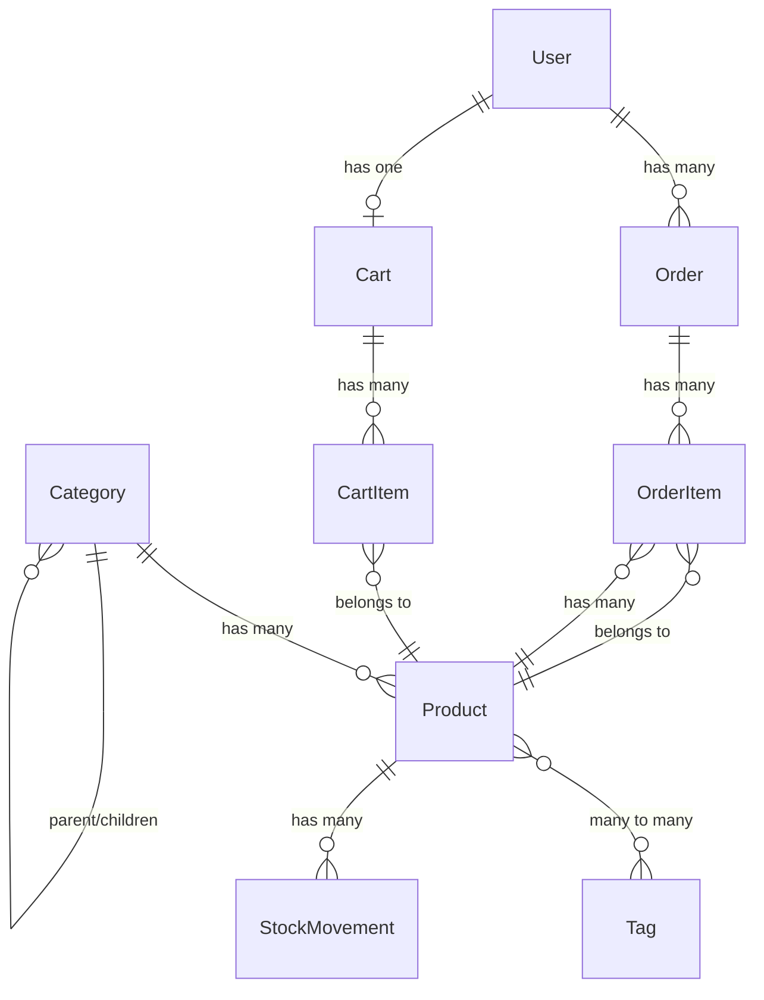

# Relatório Técnico — Fase 0: Setup Base

**Projeto:** Sistema de E-commerce (Desafio Full-Stack)  
**Data de execução:** 2026-02-27  
**Responsável:** Agente 0 (Setup Base)  
**Status:** ✅ Concluída  

---

## 1. Objetivo

Estabelecer a fundação técnica compartilhada do projeto, criando a infraestrutura necessária para que os 5 agentes da Fase 1 possam trabalhar em paralelo sem conflitos. Isso inclui: instalação de dependências, configuração do ambiente, criação dos Models e migrações, setup do frontend React + Inertia e preparação de artefatos compartilhados.

---

## 2. Dependências Instaladas

### 2.1 Composer (Backend)

| Pacote | Versão | Tipo | Justificativa |
|--------|--------|------|---------------|
| `laravel/sanctum` | ^4.3 | Produção | Autenticação via API tokens (SPA stateful) — requisito do desafio |
| `spatie/laravel-permission` | ^6.24 | Produção | Sistema de roles e permissions (admin/customer) — requisito do desafio |
| `darkaonline/l5-swagger` | ^10.1 | Produção | Documentação OpenAPI/Swagger da API REST — requisito do desafio |
| `inertiajs/inertia-laravel` | ^2.0 | Produção | Server-side adapter do Inertia.js para integração Laravel ↔ React |
| `laravel/telescope` | ^5.18 | Dev | Ferramenta de debug e monitoramento em ambiente de desenvolvimento |

### 2.2 NPM (Frontend)

| Pacote | Tipo | Justificativa |
|--------|------|---------------|
| `react`, `react-dom` | Produção | Framework de UI escolhido para o frontend SPA |
| `@inertiajs/react` | Produção | Client-side adapter do Inertia.js para React |
| `@types/react`, `@types/react-dom` | Produção | Tipagens TypeScript para React |
| `typescript` | Dev | Compilador TypeScript — type safety exigido pelo desafio |
| `@vitejs/plugin-react` | Dev | Plugin Vite para suporte a JSX/TSX e Fast Refresh |
| `react-hot-toast` | Produção | Toast notifications para feedback ao usuário |
| `react-hook-form` | Produção | Gerenciamento de formulários com performance otimizada |
| `@hookform/resolvers` | Produção | Bridge entre react-hook-form e bibliotecas de validação |
| `zod` | Produção | Schema validation com inferência de tipos TypeScript |

---

## 3. Configuração do Ambiente

### 3.1 Arquivo `.env`

O `.env` foi configurado com os seguintes parâmetros relevantes:

- **Database:** SQLite (para desenvolvimento local sem dependência de MySQL)
- **Queue:** `database` (fila via banco de dados)
- **Cache:** `file` (cache em disco)
- **APP_KEY:** Gerada via `php artisan key:generate`

> **Nota:** O projeto está preparado para MySQL. Para ativar, basta alterar `DB_CONNECTION=mysql` e descomentar `DB_HOST`, `DB_PORT`, `DB_DATABASE`, `DB_USERNAME`, `DB_PASSWORD` no `.env`.

### 3.2 Sanctum

- Publicados: `config/sanctum.php` e migration `create_personal_access_tokens_table`
- Middleware `statefulApi()` registrado no `bootstrap/app.php`

### 3.3 Spatie Permission

- Publicados: `config/permission.php` e migration `create_permission_tables`
- Trait `HasRoles` adicionada ao Model `User`

---

## 4. Estrutura de Pastas

A seguinte estrutura de diretórios foi criada para suportar a arquitetura em camadas exigida pelo desafio:

```
app/
├── DTOs/                          # Data Transfer Objects
├── Events/                        # Eventos de domínio
├── Jobs/                          # Jobs para processamento em fila
├── Listeners/                     # Listeners dos eventos
├── Policies/                      # Authorization policies
├── Repositories/
│   └── Contracts/                 # Interfaces dos repositories
├── Rules/                         # Regras de validação customizadas
├── Services/                      # Camada de lógica de negócio
└── Http/
    ├── Controllers/Api/V1/        # Controllers da API versionada
    ├── Requests/                  # Form Requests para validação
    └── Resources/                 # API Resource classes
```

Cada diretório contém um `.gitkeep` para preservar a estrutura no controle de versão.

---

## 5. Models e Migrações

### 5.1 Diagrama de Relacionamentos



### 5.2 Detalhamento dos Models

#### Product

| Aspecto | Implementação |
|---------|---------------|
| **Campos (`$fillable`)** | `name`, `slug`, `description`, `price`, `cost_price`, `quantity`, `min_quantity`, `active`, `category_id` |
| **Casts** | `price` → `decimal:2`, `cost_price` → `decimal:2`, `quantity` → `integer`, `min_quantity` → `integer`, `active` → `boolean` |
| **Relacionamentos** | `category()` → BelongsTo, `tags()` → BelongsToMany (com timestamps), `orderItems()` → HasMany, `stockMovements()` → HasMany |
| **Scopes** | `scopeActive()` → `where('active', true)`, `scopeInStock()` → `where('quantity', '>', 0)`, `scopeLowStock()` → `whereColumn('quantity', '<=', 'min_quantity')` |
| **Traits** | `HasFactory`, `SoftDeletes` |
| **Auto-slug** | Gera slug automaticamente no `creating` e atualiza no `updating` quando o `name` muda |

#### Category

| Aspecto | Implementação |
|---------|---------------|
| **Campos** | `name`, `slug`, `description`, `parent_id`, `active` |
| **Casts** | `active` → `boolean` |
| **Relacionamentos** | `parent()` → BelongsTo (self), `children()` → HasMany (self), `products()` → HasMany |
| **Auto-slug** | Sim, nos hooks `creating` e `updating` |

#### Tag

| Aspecto | Implementação |
|---------|---------------|
| **Campos** | `name`, `slug` |
| **Relacionamentos** | `products()` → BelongsToMany (com timestamps) |
| **Auto-slug** | Sim, no hook `creating` |

#### Order

| Aspecto | Implementação |
|---------|---------------|
| **Campos** | `user_id`, `status`, `total`, `subtotal`, `tax`, `shipping_cost`, `shipping_address`, `billing_address`, `notes` |
| **Casts** | `total`, `subtotal`, `tax`, `shipping_cost` → `decimal:2` |
| **Relacionamentos** | `user()` → BelongsTo, `items()` → HasMany |
| **Constantes** | `STATUSES` = `['pending', 'processing', 'shipped', 'delivered', 'cancelled']` |

#### OrderItem

| Aspecto | Implementação |
|---------|---------------|
| **Campos** | `order_id`, `product_id`, `quantity`, `unit_price`, `total_price` |
| **Casts** | `quantity` → `integer`, `unit_price`/`total_price` → `decimal:2` |
| **Relacionamentos** | `order()` → BelongsTo, `product()` → BelongsTo |

#### StockMovement

| Aspecto | Implementação |
|---------|---------------|
| **Campos** | `product_id`, `type`, `quantity`, `reason`, `reference_type`, `reference_id` |
| **Casts** | `quantity` → `integer` |
| **Relacionamentos** | `product()` → BelongsTo, `reference()` → MorphTo (polimórfico) |
| **Constantes** | `TYPES` = `['entrada', 'saida', 'ajuste', 'venda', 'devolucao']` |

#### Cart

| Aspecto | Implementação |
|---------|---------------|
| **Campos** | `user_id`, `session_id` |
| **Relacionamentos** | `user()` → BelongsTo, `items()` → HasMany |

#### CartItem

| Aspecto | Implementação |
|---------|---------------|
| **Campos** | `cart_id`, `product_id`, `quantity` |
| **Casts** | `quantity` → `integer` |
| **Relacionamentos** | `cart()` → BelongsTo, `product()` → BelongsTo |

#### User (atualizado)

| Aspecto | Implementação |
|---------|---------------|
| **Traits adicionadas** | `HasApiTokens` (Sanctum), `HasRoles` (Spatie Permission) |
| **Relacionamentos adicionados** | `orders()` → HasMany, `cart()` → HasOne |

### 5.3 Migrações

14 migrações executadas com sucesso:

| Migration | Índices Notáveis |
|-----------|-----------------|
| `create_users_table` | (padrão Laravel) |
| `create_cache_table` | (padrão Laravel) |
| `create_jobs_table` | (padrão Laravel) |
| `create_personal_access_tokens_table` | (Sanctum) |
| `create_permission_tables` | (Spatie Permission) |
| `create_categories_table` | `active`, FK `parent_id` self-ref com `nullOnDelete` |
| `create_tags_table` | `name` unique, `slug` unique |
| `create_products_table` | `name` unique, `slug` unique, `active`, `price`, composto `[active, quantity]`, FK `category_id`, soft deletes |
| `create_orders_table` | `status`, composto `[user_id, status]`, FK `user_id` |
| `create_order_items_table` | Composto `[order_id, product_id]`, FKs |
| `create_stock_movements_table` | Composto `[product_id, type]`, `nullableMorphs('reference')` |
| `create_carts_table` | `session_id`, `user_id`, FKs |
| `create_cart_items_table` | Unique `[cart_id, product_id]`, FKs |
| `create_product_tag_table` | Unique `[product_id, tag_id]`, FKs |

> **Decisão técnica:** A ordenação das migrações foi ajustada manualmente para garantir que `categories` e `tags` sejam criadas antes de `products` (que depende de `category_id` como FK) e `product_tag` (que depende de ambas as FKs).

---

## 6. Configuração do Application Bootstrap

O arquivo `bootstrap/app.php` foi configurado com:

```php
->withRouting(
    web: __DIR__.'/../routes/web.php',
    api: __DIR__.'/../routes/api.php',  // ← Adicionado
    commands: __DIR__.'/../routes/console.php',
    health: '/up',
)
->withMiddleware(function (Middleware $middleware): void {
    $middleware->statefulApi();  // ← Sanctum stateful para SPA
})
->booting(function (): void {
    RateLimiter::for('api', function (Request $request): Limit {
        return Limit::perMinute(100)->by($request->user()?->id ?: $request->ip());
    });
})
```

**Decisões:**
- **`statefulApi()`**: Habilita autenticação baseada em cookies para SPA (Inertia.js), sem necessidade de tokens explícitos no frontend.
- **Rate limiting 100/min**: Conforme requisito do desafio, por user ID (autenticado) ou IP (anônimo).
- **`routes/api.php`**: Arquivo stub criado com grupo `prefix('v1')` — será populado pelo Agente 1.

---

## 7. Configuração do Frontend

### 7.1 Vite

```js
plugins: [
    laravel({ input: ['resources/css/app.css', 'resources/js/app.tsx'], refresh: true }),
    tailwindcss(),
    react(),
],
resolve: { alias: { '@': '/resources/js' } },
```

- Entry point alterado de `app.js` para `app.tsx`
- Plugin `@vitejs/plugin-react` adicionado para suporte JSX/TSX e React Fast Refresh
- Alias `@` → `resources/js` para imports limpos (ex: `import { Product } from '@/types/shared'`)

### 7.2 TypeScript

`tsconfig.json` configurado com:
- **Target/Module:** ESNext com resolução `bundler`
- **JSX:** `react-jsx` (transformação automática, sem necessidade de `import React`)
- **Strict mode:** Habilitado
- **Path alias:** `@/*` → `resources/js/*`

### 7.3 Inertia.js

**Entry point (`resources/js/app.tsx`):**
- Usa `createInertiaApp` com resolução dinâmica de páginas via `import.meta.glob`
- Páginas são resolvidas do diretório `./Pages/**/*.tsx`

**Root template (`resources/views/app.blade.php`):**
- Inclui `@viteReactRefresh` para hot reload
- Inclui `@inertiaHead` para meta tags dinâmicas
- Inclui `@inertia` para renderização da App React

### 7.4 TypeScript Types Compartilhados

Arquivo `resources/js/types/shared.ts` com interfaces que espelham os Models do backend:

| Interface | Descrição |
|-----------|-----------|
| `Product` | Todos os campos + `category` e `tags` embutidos |
| `Category` | Com `children` recursivo opcional |
| `Tag` | `id`, `name`, `slug` |
| `Order` | Com `items` embutido e `OrderStatus` type union |
| `OrderItem` | Com `product` embutido |
| `User` | `id`, `name`, `email` |
| `PaginatedResponse<T>` | Genérico com `data`, `meta` e `links` (padrão Laravel) |

> **Regra de ownership:** Este arquivo é de propriedade exclusiva da Fase 0. Os Agentes 3 e 4 devem importar de `@/types/shared` e criar extensões em seus próprios arquivos (`admin.ts`, `public.ts`).

### 7.5 Componente SkeletonLoader

`resources/js/Components/Shared/SkeletonLoader.tsx` — componente reutilizável com 5 variantes:

| Variante | Uso pretendido |
|----------|----------------|
| `card` | Loading de cards de produto |
| `table` | Loading de tabelas de dados (admin) |
| `form` | Loading de formulários |
| `text` | Loading de blocos de texto |
| `avatar` | Loading de avatar com nome |

Usa `animate-pulse` do Tailwind CSS com suporte a dark mode (`dark:bg-gray-700`).

---

## 8. Rotas Web (Stubs)

Rotas Inertia stub criadas em `routes/web.php` para permitir desenvolvimento visual paralelo:

| Grupo | Rotas |
|-------|-------|
| **Públicas** | `/`, `/products`, `/products/{slug}`, `/login`, `/register` |
| **Autenticadas** | `/cart`, `/checkout`, `/orders`, `/profile` |
| **Admin** | `/admin/dashboard`, `/admin/products`, `/admin/products/create`, `/admin/categories`, `/admin/orders`, `/admin/stock/low` |

> Todas as rotas usam `Inertia::render('NomeDaPagina')` sem dados. Na Fase de Integração, serão substituídas por controllers que passam dados reais via `Inertia::render()`.

---

## 9. Verificação Final

| Verificação | Resultado |
|-------------|-----------|
| `php artisan migrate:status` | 14/14 migrações executadas ✅ |
| `npm run build` | Build de produção com sucesso (774 modules, 3.07s) ✅ |
| `vendor/bin/pint --format agent` | Todos os arquivos PHP formatados (PSR-12) ✅ |
| Working tree | Limpo após 12 commits atômicos ✅ |

---

## 10. Histórico de Commits

```
6e7d887 Fase 0 - criar rotas web stub para desenvolvimento (public, auth, admin com Inertia::render)
e63e46e Fase 0 - criar componente SkeletonLoader compartilhado (5 variantes: card, table, form, text, avatar)
9ec8183 Fase 0 - criar TypeScript types compartilhados (Product, Category, Tag, Order, User, PaginatedResponse)
8843523 Fase 0 - criar layout base Inertia (app.tsx entry, app.blade.php root template, Home stub)
8149acd Fase 0 - configurar Vite + React + Inertia (plugin react, entry app.tsx, alias @, tsconfig)
8515a6a Fase 0 - configurar bootstrap/app.php (API routing, Sanctum stateful, rate limiting 100/min)
b5c4952 Fase 0 - criar Models base com migrations, factories e relacionamentos
b531c1b Fase 0 - criar estrutura de pastas da arquitetura (DTOs, Repositories, Services, ...)
57d1200 Fase 0 - configurar Spatie Permission (publish config e migration)
3caec44 Fase 0 - configurar Laravel Sanctum (publish config e migration)
0e47daf Fase 0 - instalar dependencias NPM (react, inertia, typescript, react-hook-form, zod)
90268f8 Fase 0 - instalar dependencias Composer (sanctum, spatie-permission, l5-swagger, telescope, inertia)
```

---

## 11. Regras de Ownership para Fase 1

Para evitar conflitos durante o desenvolvimento paralelo dos 5 agentes:

| Arquivo/Diretório | Owner | Outros agentes |
|---|---|---|
| `app/Providers/AppServiceProvider.php` | Agente 1 | Não tocar |
| `routes/api.php` | Agente 1 | Não tocar |
| `routes/web.php` | Fase 0 / Integração | Não tocar na Fase 1 |
| `resources/js/types/shared.ts` | Fase 0 | Importar, não modificar |
| `resources/js/Components/Admin/` | Agente 3 | Exclusivo |
| `resources/js/Components/Public/` | Agente 4 | Exclusivo |
| `resources/js/Components/Shared/` | Fase 0 | Importar, não modificar |
| `config/logging.php` | Agente 5 | Exclusivo |
| `tsconfig.json`, `.eslintrc.json`, `.prettierrc` | Agente 5 | Exclusivo |
| `tests/` | Agente 2 | Exclusivo |

---

## 12. Próximos Passos

Com a Fase 0 concluída, os 5 agentes podem ser iniciados em paralelo:

1. **🔵 Agente 1 (Backend Core):** Repositories, Services, DTOs, Controllers, Rotas API, Events, Jobs, Policies, Seeders
2. **🟢 Agente 2 (Testes):** Testes unitários dos Models (imediato), testes de API/Feature (após Agente 1)
3. **🟡 Agente 3 (Frontend Admin):** Layout admin, componentes, Dashboard, CRUDs
4. **🟠 Agente 4 (Frontend Público):** Layout público, componentes, Homepage, Produtos, Carrinho, Checkout
5. **🟣 Agente 5 (Docs & DevOps):** Swagger, PROJECT.md, Logging, ESLint/Prettier, TypeScript config
