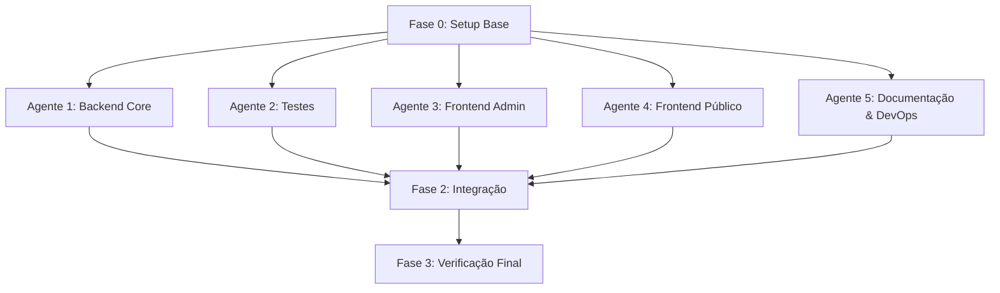

# Plano de Implementação — Sistema de E-commerce (Desafio Full-Stack)

## Visão Geral

Desenvolvimento de um sistema e-commerce completo com **Laravel 12** (API backend) e **React + TypeScript + Inertia.js** (frontend SPA), conforme definido no [README-challenge.md](file:///c:/Users/spyki/OneDrive/Documentos/DEV/e-commerce-challenge/README-challenge.md).

O projeto já possui um scaffold Laravel 12 configurado com Tailwind CSS v4, Vite, PHPUnit e Laravel Boost.

---

## Decisão Tecnológica para o Frontend

> [!IMPORTANT]
> O desafio permite escolher entre **React**, **Vue.js** ou **Blade Templates**. Recomendo **React + TypeScript + Inertia.js** pelos seguintes motivos:
> - O Vite já está configurado no projeto
> - TypeScript oferece type safety exigido pelo desafio
> - Inertia.js integra perfeitamente com Laravel sem precisar de API separada para o frontend
> - React tem o ecossistema mais maduro de ferramentas e componentes
>
> **Se preferir outra abordagem (Vue ou Blade), me avise antes de prosseguir.**

---

## Arquitetura de Módulos Paralelos

O desenvolvimento é dividido em **5 agentes independentes** que podem trabalhar em paralelo, seguidos de uma **fase de integração**. A árvore abaixo mostra as dependências:



---

## Fase 0 — Setup Base (Pré-requisito, Sequencial)

> Esta fase deve ser feita **antes** de iniciar os agentes paralelos. Ela cria a fundação compartilhada.

### Passo a Passo

1. **Instalar dependências adicionais do Composer:**
   ```bash
   composer require laravel/sanctum
   composer require spatie/laravel-permission
   composer require darkaonline/l5-swagger
   composer require --dev laravel/telescope
   ```

2. **Instalar dependências do NPM (frontend React + Inertia):**
   ```bash
   npm install react react-dom @inertiajs/react @types/react @types/react-dom
   npm install -D typescript @vitejs/plugin-react
   npm install react-hot-toast react-hook-form @hookform/resolvers zod
   npm install @tanstack/react-query axios
   ```

3. **Configurar o [.env](file:///c:/Users/spyki/OneDrive/Documentos/DEV/e-commerce-challenge/.env):**
   - `DB_CONNECTION=mysql`
   - `DB_HOST=127.0.0.1`
   - `DB_PORT=3306`
   - `DB_DATABASE=ecommerce`
   - `DB_USERNAME=root`
   - `DB_PASSWORD=` (definir senha local)
   - `QUEUE_CONNECTION=database`
   - `CACHE_STORE=file` (ou `redis`)
   - Gerar chave: `php artisan key:generate`
   - Criar o banco de dados MySQL: `CREATE DATABASE ecommerce;`

4. **Configurar Sanctum:**
   ```bash
   php artisan vendor:publish --provider="Laravel\Sanctum\SanctumServiceProvider"
   ```

5. **Configurar Spatie Permission:**
   ```bash
   php artisan vendor:publish --provider="Spatie\Permission\PermissionServiceProvider"
   ```

6. **Criar estrutura de pastas da arquitetura em camadas:**
   ```
   app/
   ├── DTOs/
   ├── Repositories/
   │   └── Contracts/
   ├── Services/
   ├── Events/
   ├── Listeners/
   ├── Jobs/
   ├── Rules/
   ├── Http/
   │   ├── Controllers/Api/V1/
   │   ├── Requests/
   │   ├── Resources/
   │   └── Middleware/
   └── Models/
   ```

7. **Criar os Models base** (apenas as classes vazias com campos `$fillable` e relacionamentos) — eles são compartilhados entre todos os agentes:
   - `Product`, `Category`, `Tag`, `Order`, `OrderItem`, `StockMovement`, `Cart`, `CartItem`

8. **Criar todas as Migrations** com os campos e índices especificados no desafio.

9. **Configurar [bootstrap/app.php](file:///c:/Users/spyki/OneDrive/Documentos/DEV/e-commerce-challenge/bootstrap/app.php)** com middleware de rate limiting, Sanctum, etc.

10. **Configurar [vite.config.js](file:///c:/Users/spyki/OneDrive/Documentos/DEV/e-commerce-challenge/vite.config.js)** para suportar React + Inertia.

11. **Criar o layout base do Inertia** (`resources/js/app.tsx`, `resources/js/Layouts/`).

12. **Solicitar commit ao humano:** Pause e sugira: `feat: project base setup with architecture scaffolding`

---

## Fase 1 — Desenvolvimento Paralelo (5 Agentes)

---

### 🔵 Agente 1: Backend Core (API + Lógica de Negócio)

**Escopo:** Toda a lógica de negócio, controllers, services, repositories, DTOs, events, listeners, jobs, cache, validação.

**Skills Recomendadas (skills.sh):**
- [api-design-principles](https://skills.sh/wshobson/agents/api-design-principles) — Boas práticas de design de API REST
- [architecture-patterns](https://skills.sh/wshobson/agents/architecture-patterns) — Service Layer, Repository Pattern
- [error-handling-patterns](https://skills.sh/wshobson/agents/error-handling-patterns) — Tratamento de erros robusto
- [sql-optimization-patterns](https://skills.sh/wshobson/agents/sql-optimization-patterns) — Otimização de queries
- [security-requirement-extraction](https://skills.sh/wshobson/agents/security-requirement-extraction) — Requisitos de segurança
- [executing-plans](https://skills.sh/obra/superpowers/executing-plans) — Execução metódica de planos

#### Passo a Passo Detalhado

**1. Interfaces de Repository (Contracts)**
| Arquivo | Descrição |
|---------|-----------|
| `app/Repositories/Contracts/ProductRepositoryInterface.php` | CRUD + filtros, busca, paginação |
| `app/Repositories/Contracts/CategoryRepositoryInterface.php` | CRUD + árvore hierárquica |
| `app/Repositories/Contracts/OrderRepositoryInterface.php` | CRUD + filtros por status |
| `app/Repositories/Contracts/CartRepositoryInterface.php` | Get/Create, items management |
| `app/Repositories/Contracts/StockMovementRepositoryInterface.php` | Registrar movimentações |

**2. Implementações de Repository**
| Arquivo | Descrição |
|---------|-----------|
| `app/Repositories/ProductRepository.php` | Eloquent, eager loading, scopes, filtros |
| `app/Repositories/CategoryRepository.php` | Árvore com `parent_id`, recursive children |
| `app/Repositories/OrderRepository.php` | Com OrderItems, status transitions |
| `app/Repositories/CartRepository.php` | Session/User-based cart |
| `app/Repositories/StockMovementRepository.php` | Tipos de movimentação |

**3. DTOs**
| Arquivo | Descrição |
|---------|-----------|
| `app/DTOs/ProductDTO.php` | Dados de produto para transferência entre camadas |
| `app/DTOs/OrderDTO.php` | Dados de pedido |
| `app/DTOs/CartItemDTO.php` | Dados de item do carrinho |
| `app/DTOs/StockMovementDTO.php` | Dados de movimentação de estoque |

**4. Services (Lógica de Negócio)**
| Arquivo | Responsabilidades |
|---------|-------------------|
| `app/Services/ProductService.php` | CRUD, slug auto, validação de preço, cache invalidation |
| `app/Services/CategoryService.php` | CRUD, árvore hierárquica, cache |
| `app/Services/CartService.php` | Add/remove/update items, validação estoque |
| `app/Services/OrderService.php` | Criar pedido do carrinho, validar estoque, calcular totais, taxa, frete |
| `app/Services/StockService.php` | Movimentações, verificação de estoque baixo |

**5. Form Requests (Validação)**
| Arquivo | Regras |
|---------|--------|
| `app/Http/Requests/StoreProductRequest.php` | name unique, price > 0, cost_price < price |
| `app/Http/Requests/UpdateProductRequest.php` | Mesmas regras, exceto unique com ignore |
| `app/Http/Requests/StoreOrderRequest.php` | Validação de endereço, estoque |
| `app/Http/Requests/AddCartItemRequest.php` | product_id existe, quantity > 0 |
| `app/Http/Requests/UpdateCartItemRequest.php` | quantity > 0 |
| `app/Http/Requests/UpdateOrderStatusRequest.php` | status in allowed values |

**6. API Resource Classes**
| Arquivo | Descrição |
|---------|-----------|
| `app/Http/Resources/ProductResource.php` | Formato JSON com category e tags |
| `app/Http/Resources/ProductCollection.php` | Paginação com meta e links |
| `app/Http/Resources/CategoryResource.php` | Com children recursivos |
| `app/Http/Resources/OrderResource.php` | Com items e user |
| `app/Http/Resources/CartResource.php` | Com items e totais |

**7. Controllers (API v1)**
| Arquivo | Endpoints |
|---------|-----------|
| `app/Http/Controllers/Api/V1/ProductController.php` | GET list, GET show, POST store, PUT update, DELETE destroy |
| `app/Http/Controllers/Api/V1/CategoryController.php` | GET list, GET products |
| `app/Http/Controllers/Api/V1/CartController.php` | GET show, POST addItem, PUT updateItem, DELETE removeItem, DELETE clear |
| `app/Http/Controllers/Api/V1/OrderController.php` | GET list, GET show, POST store, PUT updateStatus |
| `app/Http/Controllers/Api/V1/AuthController.php` | POST register, POST login, POST logout, GET user |

**8. Rotas API** (`routes/api.php`)
```php
Route::prefix('v1')->group(function () {
    // Auth
    Route::post('register', ...);
    Route::post('login', ...);

    // Public
    Route::get('products', ...);
    Route::get('products/{product}', ...);
    Route::get('categories', ...);
    Route::get('categories/{category}/products', ...);

    // Authenticated
    Route::middleware('auth:sanctum')->group(function () {
        // Cart, Orders, Logout, User
    });

    // Admin only
    Route::middleware(['auth:sanctum', 'role:admin'])->group(function () {
        // Product CRUD, Order status update
    });
});
```

**9. Events & Listeners**
| Evento | Listener | Ação |
|--------|----------|------|
| `ProductCreated` | `LogProductCreated` | Log + possível notificação |
| `OrderCreated` | `ProcessOrderListener` | Dispatch job de processamento |
| `StockLow` | `NotifyStockLow` | Log + notificação admin |

**10. Jobs (Filas)**
| Job | Descrição |
|-----|-----------|
| `ProcessOrderJob` | Processar pedido em background |
| `SendOrderConfirmationEmail` | Email de confirmação |
| `UpdateStockAfterOrder` | Atualizar estoque + criar StockMovement |

**11. Policies (Autorização)**
| Policy | Regras |
|--------|--------|
| `ProductPolicy` | Apenas admin cria/edita/exclui |
| `OrderPolicy` | Usuário vê/gerencia apenas seus pedidos; admin vê todos |

**12. Scopes no Model Product**
- `scopeActive($query)` — `where('active', true)`
- `scopeInStock($query)` — `where('quantity', '>', 0)`
- `scopeLowStock($query)` — `whereColumn('quantity', '<=', 'min_quantity')`

**13. Custom Validation Rules**
| Regra | Descrição |
|-------|-----------|
| `app/Rules/SufficientStock.php` | Verifica se produto tem estoque |
| `app/Rules/ValidParentCategory.php` | Verifica se parent_id é válido |
| `app/Rules/UniqueSlug.php` | Slug único por model |

**14. Cache**
- Produtos: TTL 1 hora, invalidar ao criar/editar/excluir
- Categorias: TTL 24 horas, invalidar ao alterar
- Usar cache tags (`products`, `categories`)

**15. Seeders & Factories**
| Arquivo | Descrição |
|---------|-----------|
| `database/factories/ProductFactory.php` | Dados realistas de produtos |
| `database/factories/CategoryFactory.php` | Categorias com hierarquia |
| `database/factories/TagFactory.php` | Tags variadas |
| `database/factories/OrderFactory.php` | Pedidos com diferentes status |
| `database/seeders/RoleAndPermissionSeeder.php` | Roles: admin, customer |
| `database/seeders/UserSeeder.php` | Admin + clientes de teste |
| `database/seeders/ProductSeeder.php` | 50+ produtos com categorias e tags |
| `database/seeders/OrderSeeder.php` | Pedidos de exemplo |

**16. Registro de bindings no `AppServiceProvider`**
- Bind repository interfaces às implementações

---

### 🟢 Agente 2: Testes (Unitários, Integração, Feature)

**Escopo:** Toda a suíte de testes PHPUnit cobrindo ≥80% do código.

**Skills Recomendadas (skills.sh):**
- [test-driven-development](https://skills.sh/obra/superpowers/test-driven-development) — TDD e melhores práticas
- [webapp-testing](https://skills.sh/anthropics/skills/webapp-testing) — Testes de webapp completos
- [e2e-testing-patterns](https://skills.sh/wshobson/agents/e2e-testing-patterns) — Padrões de testes E2E
- [verification-before-completion](https://skills.sh/obra/superpowers/verification-before-completion) — Verificação rigorosa
- [systematic-debugging](https://skills.sh/obra/superpowers/systematic-debugging) — Debugging sistemático

> [!WARNING]
> **Este agente depende parcialmente do Agente 1.** Estratégia de 2 lançamentos:
> - **Lançamento 1 (imediato):** Testes unitários de Models e Repositories (Etapas 1-2)
> - **Lançamento 2 (após Agente 1):** Testes de Services, API, Features e Autorização (Etapas 3-7)

#### Passo a Passo Detalhado

**1. Testes Unitários de Models** (`tests/Unit/Models/`)
| Teste | O que cobre |
|-------|-------------|
| `ProductTest.php` | Relacionamentos (category, tags, orderItems, stockMovements), scopes (active, inStock, lowStock), mutators, soft delete |
| `CategoryTest.php` | Relacionamentos (parent, children, products), slug auto |
| `TagTest.php` | Relacionamento belongsToMany com Product |
| `OrderTest.php` | Relacionamentos (user, items), status enum/cast, cálculos |
| `OrderItemTest.php` | Relacionamentos, cálculo de total_price |
| `CartTest.php` | Relacionamentos (user, items) |
| `CartItemTest.php` | Relacionamentos |
| `StockMovementTest.php` | Relacionamentos, tipos |

**2. Testes Unitários de Services** (`tests/Unit/Services/`)
| Teste | O que cobre |
|-------|-------------|
| `ProductServiceTest.php` | Criação, atualização, exclusão, busca com filtros |
| `CartServiceTest.php` | Adicionar/remover itens, validar estoque |
| `OrderServiceTest.php` | Criar pedido do carrinho, validar estoque, calcular totais |
| `StockServiceTest.php` | Movimentações, alerta estoque baixo |

**3. Testes Unitários de Repositories** (`tests/Unit/Repositories/`)
| Teste | O que cobre |
|-------|-------------|
| `ProductRepositoryTest.php` | CRUD, filtros, paginação, eager loading |
| `CategoryRepositoryTest.php` | CRUD, árvore hierárquica |
| `OrderRepositoryTest.php` | CRUD, filtros |

**4. Testes de Integração (API)** (`tests/Feature/Api/V1/`)
| Teste | O que cobre |
|-------|-------------|
| `AuthTest.php` | Register, login, logout, user info |
| `ProductApiTest.php` | CRUD completo, filtros, paginação, autenticação admin |
| `CategoryApiTest.php` | Listagem, produtos por categoria |
| `CartApiTest.php` | CRUD de itens, limpar carrinho |
| `OrderApiTest.php` | Criar pedido, listar, ver detalhes, atualizar status |

**5. Testes de Feature (Fluxos Completos)** (`tests/Feature/`)
| Teste | O que cobre |
|-------|-------------|
| `OrderFlowTest.php` | Fluxo completo: adicionar ao carrinho → checkout → pedido criado → estoque atualizado |
| `CartFlowTest.php` | Adicionar itens → atualizar → remover → limpar |
| `StockFlowTest.php` | Criar pedido → estoque diminui → stock movement criado → alerta low stock |

**6. Testes de Validação** (`tests/Feature/ValidationTest.php`)
- Validação de campos obrigatórios
- Regras customizadas (estoque, slug, parent_id)

**7. Testes de Autorização** (`tests/Feature/AuthorizationTest.php`)
- Admin vs Customer permissions
- Rate limiting

---

### 🟡 Agente 3: Frontend Admin (Dashboard + CRUD)

**Escopo:** Todas as páginas administrativas — Dashboard, CRUD de produtos, categorias, pedidos, relatório de estoque.

**Skills Recomendadas (skills.sh):**
- [frontend-design](https://skills.sh/anthropics/claude-code/frontend-design) — Design de frontend premium
- [ui-ux-pro-max](https://skills.sh/nextlevelbuilder/ui-ux-pro-max-skill/ui-ux-pro-max) — UX/UI avançado
- [tailwind-design-system](https://skills.sh/wshobson/agents/tailwind-design-system) — Design system Tailwind
- [responsive-design](https://skills.sh/wshobson/agents/responsive-design) — Design responsivo
- [typescript-advanced-types](https://skills.sh/wshobson/agents/typescript-advanced-types) — TypeScript avançado
- [executing-plans](https://skills.sh/obra/superpowers/executing-plans) — Execução metódica de planos

#### Passo a Passo Detalhado

**1. Layout Admin** (`resources/js/Layouts/AdminLayout.tsx`)
- Sidebar responsiva com navegação
- Header com user info e logout
- Breadcrumbs

**2. Componentes Compartilhados Admin** (`resources/js/Components/Admin/`)
| Componente | Descrição |
|------------|-----------|
| `DataTable.tsx` | Tabela genérica com sort, filtro e paginação |
| `StatCard.tsx` | Card de métricas para dashboard |
| `FormField.tsx` | Campo de formulário reutilizável |
| `Modal.tsx` | Modal de confirmação/ação |
| `StatusBadge.tsx` | Badge de status com cores |
| `Sidebar.tsx` | Sidebar de navegação |
| `SearchBar.tsx` | Barra de busca global |
| *(importar `SkeletonLoader` de `Shared/`)* | Loading states |

**3. Páginas Admin** (`resources/js/Pages/Admin/`)
| Página | Funcionalidade |
|--------|----------------|
| `Dashboard.tsx` | Métricas: total produtos, pedidos, receita, gráficos |
| `Products/Index.tsx` | Lista com filtros, busca, paginação |
| `Products/Create.tsx` | Formulário de criação com validação |
| `Products/Edit.tsx` | Formulário de edição |
| `Products/Show.tsx` | Detalhes do produto |
| `Categories/Index.tsx` | Lista hierárquica (árvore) |
| `Categories/Create.tsx` | Formulário de criação |
| `Categories/Edit.tsx` | Formulário de edição |
| `Orders/Index.tsx` | Lista com filtros por status |
| `Orders/Show.tsx` | Detalhes com itens e atualização de status |
| `Stock/LowStock.tsx` | Relatório de produtos com estoque baixo |

**4. Gerenciamento de Estado**
- React Query para data fetching e cache
- React Hook Form + Zod para formulários
- Toast notifications para feedback

**5. Roteamento Admin**
- Rotas protegidas via middleware Inertia (`auth`, `role:admin`)

---

### 🟠 Agente 4: Frontend Público (Loja + Autenticação)

**Escopo:** Homepage, listagem de produtos, detalhe do produto, carrinho, checkout, pedidos, perfil, login/registro.

**Skills Recomendadas (skills.sh):**
- [frontend-design](https://skills.sh/anthropics/claude-code/frontend-design) — Design de frontend premium
- [ui-ux-pro-max](https://skills.sh/nextlevelbuilder/ui-ux-pro-max-skill/ui-ux-pro-max) — UX/UI avançado
- [tailwind-design-system](https://skills.sh/wshobson/agents/tailwind-design-system) — Design system Tailwind
- [responsive-design](https://skills.sh/wshobson/agents/responsive-design) — Design responsivo
- [interface-design](https://skills.sh/dammyjay93/interface-design/interface-design) — Design de interfaces
- [executing-plans](https://skills.sh/obra/superpowers/executing-plans) — Execução metódica de planos

#### Passo a Passo Detalhado

**1. Layout Público** (`resources/js/Layouts/PublicLayout.tsx`)
- Header com navegação, busca, carrinho (badge count), login
- Footer com informações
- Design responsivo mobile-first

**2. Componentes Compartilhados** (`resources/js/Components/Public/`)
| Componente | Descrição |
|------------|-----------|
| `ProductCard.tsx` | Card de produto com imagem, nome, preço, botão "Adicionar ao Carrinho" |
| `ProductGrid.tsx` | Grid responsivo de produtos |
| `CategoryFilter.tsx` | Sidebar/dropdown de filtros por categoria |
| `PriceFilter.tsx` | Slider de faixa de preço |
| `SearchInput.tsx` | Input de busca com debounce |
| `CartIcon.tsx` | Ícone do carrinho com badge |
| `CartItem.tsx` | Linha de item no carrinho |
| `OrderStatusTimeline.tsx` | Timeline visual do status do pedido |
| `QuantitySelector.tsx` | Input +/- para quantidade |
| `Pagination.tsx` | Paginação ou infinite scroll |
| *(importar `SkeletonLoader` de `Shared/`)* | Loading states e skeleton screens |

**3. Páginas Públicas** (`resources/js/Pages/`)
| Página | Funcionalidade |
|--------|----------------|
| `Home.tsx` | Hero banner, produtos em destaque, categorias |
| `Products/Index.tsx` | Lista com filtros (categoria, preço, busca), paginação |
| `Products/Show.tsx` | Detalhes, tags, botão adicionar ao carrinho |
| `Auth/Login.tsx` | Formulário de login |
| `Auth/Register.tsx` | Formulário de registro |

**4. Páginas Autenticadas** (`resources/js/Pages/Customer/`)
| Página | Funcionalidade |
|--------|----------------|
| `Cart.tsx` | Lista de itens, atualizar quantidade, remover, total, checkout |
| `Checkout.tsx` | Endereço de entrega/cobrança, notas, confirmar pedido |
| `Orders/Index.tsx` | Histórico de pedidos com status |
| `Orders/Show.tsx` | Detalhes do pedido com timeline |
| `Profile.tsx` | Perfil do usuário, editar dados |

**5. Gerenciamento de Estado**
- React Query para data fetching e cache
- Context API para carrinho (estado global)
- React Hook Form + Zod para formulários

---

### 🟣 Agente 5: Documentação & DevOps

**Escopo:** Swagger/OpenAPI, PROJECT.md, logging, configurações de qualidade de código.

**Skills Recomendadas (skills.sh):**
- [api-design-principles](https://skills.sh/wshobson/agents/api-design-principles) — Princípios de API e documentação
- [writing-plans](https://skills.sh/obra/superpowers/writing-plans) — Escrita de documentação clara
- [code-review-excellence](https://skills.sh/wshobson/agents/code-review-excellence) — Excelência em code review
- [docker-expert](https://skills.sh/sickn33/antigravity-awesome-skills/docker-expert) — Se quiser adicionar Docker (diferencial)

#### Passo a Passo Detalhado

**1. Documentação Swagger/OpenAPI**
- Configurar L5-Swagger
- Adicionar anotações `@OA\` nos controllers
- Gerar documentação acessível em `/api/documentation`

**2. PROJECT.md**
- Como executar o projeto (setup, dependências, comandos)
- Decisões arquiteturais
- Bibliotecas utilizadas e justificativas
- Estrutura de pastas
- Como executar os testes
- Como acessar a documentação da API

**3. Logging Estruturado**
- Configurar canais de log para operações críticas
- Log de criação/atualização de pedidos
- Log de movimentações de estoque
- Log de erros de autenticação

**4. Configurações de Qualidade**
- Configurar Pint (PSR-12)
- Configurar ESLint + Prettier para frontend
- `tsconfig.json` para TypeScript

**5. Migrations de Fila**
- `php artisan queue:table` + `php artisan migrate`

---

## Fase 2 — Integração (Sequencial, após Fase 1)

Após todos os agentes completarem seu trabalho, a integração conecta as partes.

### Passo a Passo

**1. Conectar Rotas Web (Inertia) com Controllers**
- Criar `routes/web.php` com rotas Inertia que renderizam as páginas React
- Criar `PageController`s do Inertia que passam dados via `Inertia::render()`
- Mapear rotas públicas, autenticadas e admin

**2. Conectar Frontend Admin com API**
- Verificar que os componentes admin chamam os endpoints corretos
- Testar CRUD de produtos, categorias, pedidos via interface

**3. Conectar Frontend Público com API**
- Verificar carrinho, checkout, histórico de pedidos
- Testar fluxo completo: navegar → adicionar ao carrinho → checkout → pedido

**4. Ajustar Autenticação**
- Garantir que Sanctum funciona com Inertia (cookies-based para SPA)
- Testar login/logout/registro no frontend

**5. Executar Seeders**
```bash
php artisan migrate:fresh --seed
```

**6. Executar Suíte de Testes Completa**
```bash
php artisan test --compact
```

**7. Verificar Cobertura**
```bash
php artisan test --coverage --min=80
```

**8. Corrigir Bugs e Ajustes Finais**
- Fix de issues encontrados na integração
- Ajustes de UI/UX
- Performance (N+1 queries, cache)

---

## Fase 3 — Verificação Final

### Testes Automatizados
```bash
# Rodar todos os testes
php artisan test --compact

# Verificar cobertura mínima de 80%
php artisan test --coverage --min=80

# Rodar Pint (formatação PHP)
vendor/bin/pint --dirty --format agent

# Rodar ESLint (formatação JS/TS)
npx eslint resources/js/ --fix

# Type check TypeScript
npx tsc --noEmit

# Build de produção
npm run build
```

### Testes Manuais
1. **Fluxo de compra completo:** Registro → Login → navegar produtos → adicionar ao carrinho → checkout → ver pedido
2. **Fluxo admin:** Login admin → dashboard → criar produto → editar → ver pedidos → atualizar status
3. **Responsividade:** Testar em mobile, tablet, desktop
4. **Swagger UI:** Acessar `/api/documentation` e testar endpoints
5. **Rate limiting:** Disparar >100 requests/minuto e verificar `429 Too Many Requests`

---

## Resumo da Paralelização

| Agente | Lançamento 1 (imediato) | Lançamento 2 (após Agente 1) | Tempo estimado |
|--------|------------------------|-------------------------------|----------------|
| 🔵 Agente 1 (Backend) | ✅ Completo | — | Alto |
| 🟢 Agente 2 (Testes) | ⚠️ Etapas 1-2 (Models, Repos) | Etapas 3-7 (Services, API, Features) | Médio |
| 🟡 Agente 3 (Admin Frontend) | ✅ Completo (com mocks) | — | Médio |
| 🟠 Agente 4 (Público Frontend) | ✅ Completo (com mocks) | — | Médio |
| 🟣 Agente 5 (Docs & DevOps) | ⚠️ Etapas 1-4 (config, docs, log) | Etapa 5 (Swagger) | Baixo |

> [!TIP]
> **Estratégia de paralelização ótima (2 fases):**
> 1. **Lançamento 1:** Inicie todos os 5 agentes após a Fase 0. Agentes 1, 3 e 4 executam completamente. Agentes 2 e 5 executam apenas suas etapas independentes.
> 2. **Lançamento 2:** Após o Agente 1 concluir, relance os Agentes 2 e 5 para completar suas etapas dependentes (testes de API/feature e Swagger).
> 3. **Fase de Integração:** Após todos os agentes concluírem, executar `agent-integration.md`.

---

## Estrutura de Pastas Final Esperada

```
e-commerce-challenge/
├── app/
│   ├── DTOs/
│   │   ├── ProductDTO.php
│   │   ├── OrderDTO.php
│   │   ├── CartItemDTO.php
│   │   └── StockMovementDTO.php
│   ├── Events/
│   │   ├── ProductCreated.php
│   │   ├── OrderCreated.php
│   │   └── StockLow.php
│   ├── Http/
│   │   ├── Controllers/
│   │   │   └── Api/V1/
│   │   │       ├── AuthController.php
│   │   │       ├── ProductController.php
│   │   │       ├── CategoryController.php
│   │   │       ├── CartController.php
│   │   │       └── OrderController.php
│   │   ├── Middleware/
│   │   ├── Requests/
│   │   │   ├── StoreProductRequest.php
│   │   │   ├── UpdateProductRequest.php
│   │   │   ├── StoreOrderRequest.php
│   │   │   ├── AddCartItemRequest.php
│   │   │   ├── UpdateCartItemRequest.php
│   │   │   └── UpdateOrderStatusRequest.php
│   │   └── Resources/
│   │       ├── ProductResource.php
│   │       ├── ProductCollection.php
│   │       ├── CategoryResource.php
│   │       ├── OrderResource.php
│   │       └── CartResource.php
│   ├── Jobs/
│   │   ├── ProcessOrderJob.php
│   │   ├── SendOrderConfirmationEmail.php
│   │   └── UpdateStockAfterOrder.php
│   ├── Listeners/
│   │   ├── LogProductCreated.php
│   │   ├── ProcessOrderListener.php
│   │   └── NotifyStockLow.php
│   ├── Models/
│   │   ├── Product.php
│   │   ├── Category.php
│   │   ├── Tag.php
│   │   ├── Order.php
│   │   ├── OrderItem.php
│   │   ├── StockMovement.php
│   │   ├── Cart.php
│   │   └── CartItem.php
│   ├── Policies/
│   │   ├── ProductPolicy.php
│   │   └── OrderPolicy.php
│   ├── Providers/
│   │   └── AppServiceProvider.php
│   ├── Repositories/
│   │   ├── Contracts/
│   │   │   ├── ProductRepositoryInterface.php
│   │   │   ├── CategoryRepositoryInterface.php
│   │   │   ├── OrderRepositoryInterface.php
│   │   │   ├── CartRepositoryInterface.php
│   │   │   └── StockMovementRepositoryInterface.php
│   │   ├── ProductRepository.php
│   │   ├── CategoryRepository.php
│   │   ├── OrderRepository.php
│   │   ├── CartRepository.php
│   │   └── StockMovementRepository.php
│   ├── Rules/
│   │   ├── SufficientStock.php
│   │   ├── ValidParentCategory.php
│   │   └── UniqueSlug.php
│   └── Services/
│       ├── ProductService.php
│       ├── CategoryService.php
│       ├── CartService.php
│       ├── OrderService.php
│       └── StockService.php
├── database/
│   ├── factories/
│   ├── migrations/
│   └── seeders/
├── resources/
│   └── js/
│       ├── app.tsx
│       ├── Components/
│       │   ├── Admin/
│       │   ├── Public/
│       │   └── Shared/
│       │       └── SkeletonLoader.tsx
│       ├── types/
│       │   ├── shared.ts
│       │   ├── admin.ts
│       │   └── public.ts
│       ├── Layouts/
│       │   ├── AdminLayout.tsx
│       │   └── PublicLayout.tsx
│       └── Pages/
│           ├── Admin/
│           │   ├── Dashboard.tsx
│           │   ├── Products/
│           │   ├── Categories/
│           │   ├── Orders/
│           │   └── Stock/
│           ├── Auth/
│           ├── Customer/
│           │   ├── Cart.tsx
│           │   ├── Checkout.tsx
│           │   ├── Orders/
│           │   └── Profile.tsx
│           ├── Home.tsx
│           └── Products/
├── routes/
│   ├── api.php
│   └── web.php
├── tests/
│   ├── Feature/
│   │   ├── Api/V1/
│   │   └── ...
│   └── Unit/
│       ├── Models/
│       ├── Repositories/
│       └── Services/
├── PROJECT.md
└── ...
```
